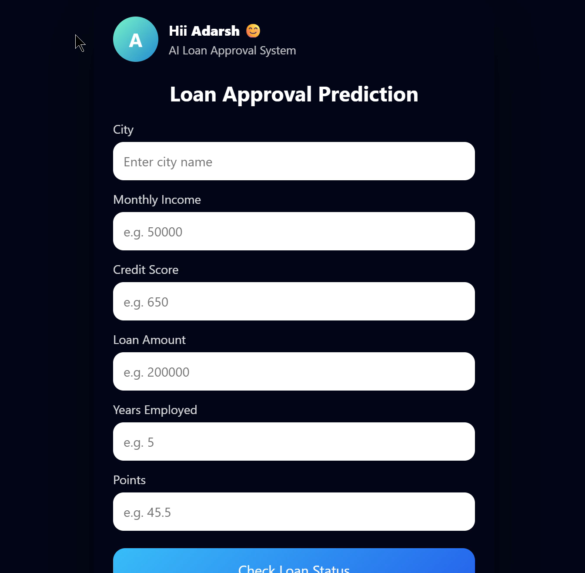

  <h1>🚀 AI Loan Eligibility Prediction Web App</h1>

  

    A full-stack Machine Learning web application that predicts loan eligibility using a trained ML model,
    served via a FastAPI backend and a cinematic, mobile-friendly frontend.
  

  

 
  <h2>📸 Project Preview</h2>
  

  

  

  <h2>✨ Key Features</h2>

  <ul style="list-style:none; padding:0; font-size:16px;">
    <li>✅ Machine Learning–based loan approval prediction</li>
    <li>✅ FastAPI backend serving real-time predictions</li>
    <li>✅ Clean REST API with JSON communication</li>
    <li>✅ Modern cinematic UI with animated effects</li>
    <li>✅ Dynamic blur-removal spotlight following mouse</li>
    <li>✅ Touch-friendly & mobile-responsive design</li>
    <li>✅ User profile card with smooth entrance animation</li>
    <li>✅ Confidence score returned with prediction</li>
  </ul>

  

  <h2>🧠 How It Works</h2>

  

    The user enters personal details such as age, income, and credit score.
    These inputs are sent from the frontend to the FastAPI backend using a REST API.
    The backend loads a trained Machine Learning model and performs inference.
    The prediction result along with confidence score is returned to the UI in real time.
  

  <pre style="background:#0f172a; color:#e5e7eb; padding:20px; border-radius:14px; margin-top:20px; text-align:left; overflow:auto;">
Frontend (HTML/CSS/JS)
        ↓
REST API (FastAPI)
        ↓
ML Model (Scikit-learn)
        ↓
Prediction + Confidence
        ↓
Frontend UI Update
  </pre>

  

  <h2>🛠 Tech Stack</h2>

  <ul style="list-style:none; padding:0; font-size:16px;">
    <li>⚙️ Backend: FastAPI (Python)</li>
    <li>🧠 Machine Learning: Scikit-learn</li>
    <li>🎨 Frontend: HTML, CSS, JavaScript</li>
    <li>📦 Model Serialization: Pickle</li>
    <li>🌐 API Protocol: REST (JSON)</li>
  </ul>

  

  <h2>🎬 Cinematic UI Effects</h2>
  

    The interface uses layered backgrounds, blur filters, radial masks, and smooth animations
    to create a premium cinematic experience.
    A spotlight effect removes blur wherever the cursor moves,
    while a soft glow follows the interaction point.
  

  <h2>📱 Mobile & Network Ready</h2>

  

    The application can be accessed from mobile devices over the same Wi-Fi network
    by running the backend on <strong>0.0.0.0</strong>.
    The frontend uses relative API paths, making it deployment-ready.
  

  

  <h2>🚧 Future Improvements</h2>

  <ul style="list-style:none; padding:0; font-size:16px;">
    <li>🔐 User authentication & profiles</li>
    <li>📊 Data visualization & analytics dashboard</li>
    <li>🖼 Image-based ML predictions</li>
    <li>☁️ Cloud deployment (public URL)</li>
    <li>📱 Conversion to React / Mobile App</li>
  </ul>

  

  

<h2 style="text-align:center;">🚀 Run This Project Locally</h2>

Follow the steps below to clone this repository and run the project
on your local machine exactly as intended.

 

<h3 style="text-align:center;">📦 Prerequisites</h3>

Make sure you have the following installed:

<ul style="list-style:none; text-align:center; padding:0;">
  <li>✔ Python 3.9 or higher</li>
  <li>✔ pip (Python package manager)</li>
  <li>✔ Git</li>
</ul>

 

<h3 style="text-align:center;">⬇️ Clone the Repository</h3>

<pre style="background:#0f172a; color:#e5e7eb; padding:18px; border-radius:12px; max-width:700px; margin:auto; text-align:left;">
git clone https://github.com/adarshkumar61/Loan_Approval_System.git
cd Loan_Approval_System
</pre>

 

<h3 style="text-align:center;">📥 Install Dependencies</h3>

(Optional but recommended) Create a virtual environment:

<pre style="background:#0f172a; color:#e5e7eb; padding:18px; border-radius:12px; max-width:700px; margin:auto; text-align:left;">
python -m venv venv
venv\Scripts\activate   <!-- Windows -->
# source venv/bin/activate  (Linux / Mac)
</pre>

Install required packages:

<pre style="background:#0f172a; color:#e5e7eb; padding:18px; border-radius:12px; max-width:700px; margin:auto; text-align:left;">
pip install -r requirements.txt
</pre>

 

<h3 style="text-align:center;">🧠 Train the Machine Learning Model</h3>

Run this step once to train and save the ML model:

<pre style="background:#0f172a; color:#e5e7eb; padding:18px; border-radius:12px; max-width:700px; margin:auto; text-align:left;">
python train_model.py
</pre>

This will generate a <strong>model.pkl</strong> file used by the API.

 

<h3 style="text-align:center;">🌐 Start the FastAPI Server</h3>

<pre style="background:#0f172a; color:#e5e7eb; padding:18px; border-radius:12px; max-width:700px; margin:auto; text-align:left;">
uvicorn app:app --reload
</pre>

Open your browser and visit:

<pre style="background:#0f172a; color:#e5e7eb; padding:14px; border-radius:12px; max-width:500px; margin:auto; text-align:center;">
http://127.0.0.1:8000/
</pre>

 

<h3 style="text-align:center;">✅ You’re All Set</h3>

You can now interact with the web interface, submit loan details,
and receive real-time predictions from the trained Machine Learning model.

  <h2>🙌 Closing Note</h2>

  

    This project demonstrates the complete pipeline of
    <strong>Machine Learning → API → Frontend</strong>,
    focusing on clean architecture, real-time inference,
    and modern UI/UX principles.
  

  

    Built with passion for learning, engineering, and real-world AI systems.
  

   
 
 

📬 CONNECT

GitHub: (https://github.com/Adarshkumar61)
LinkedIn: (https://www.linkedin.com/in/adarsh-kumar-94a859327/)

 

⭐ If this repository helped you learn ROS 2, give it a star!

